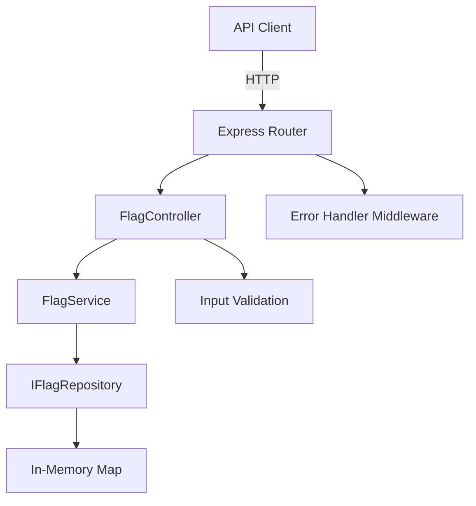
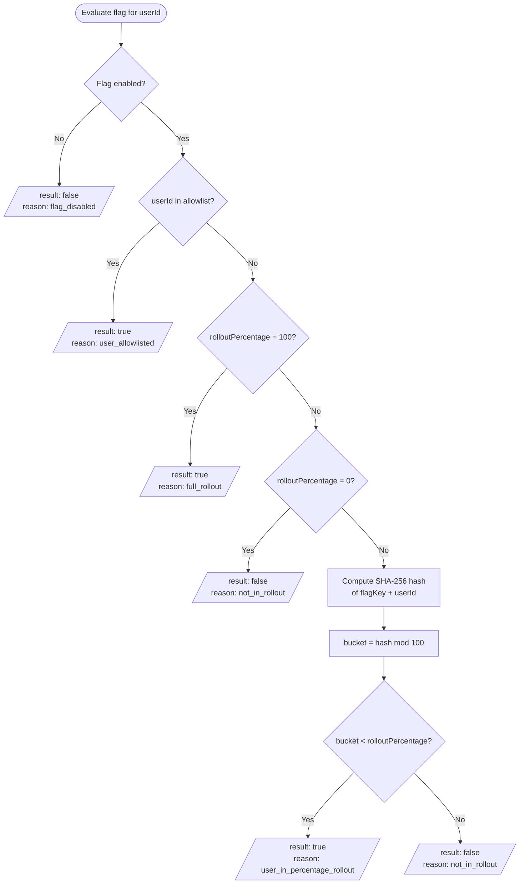

# System Design: Feature Flag Lite

## Architecture Overview

Feature Flag Lite follows a **three-layer architecture** with unidirectional dependency flow. Each layer has a single responsibility and communicates only with its adjacent layer.

```
┌─────────────┐     ┌─────────────┐     ┌─────────────┐
│  Controller │ ──▶ │   Service   │ ──▶ │ Repository  │
└─────────────┘     └─────────────┘     └─────────────┘
```

### Layer Responsibilities

| Layer | Role | Examples |
|-------|------|----------|
| **Controller** | HTTP request parsing, input validation, response formatting | `FlagController` |
| **Service** | Business logic, flag evaluation, orchestration | `FlagService` |
| **Repository** | Data persistence and retrieval | `InMemoryFlagRepository` |

### Dependency Rules

- **Controller → Service → Repository** (strict unidirectional flow)
- The Controller never accesses the Repository directly
- The Repository has no knowledge of HTTP concerns
- Each layer depends only on abstractions (interfaces) of the layer below it



---

## Data Model

### FeatureFlag Interface

```typescript
interface FeatureFlag {
  flagKey: string          // Unique identifier (alphanumeric, hyphens, underscores)
  enabled: boolean         // Master toggle for the flag
  allowlist: string[]      // User IDs that always receive true when flag is enabled
  rolloutPercentage: number // Integer 0-100 controlling gradual rollout
}
```

### Supporting Types

```typescript
interface CreateFlagInput {
  flagKey: string
  enabled: boolean
  allowlist: string[]
  rolloutPercentage: number
}

interface UpdateFlagInput {
  enabled?: boolean
  allowlist?: string[]
  rolloutPercentage?: number
}

interface EvaluationResult {
  result: boolean
  reason: EvaluationReason
}

type EvaluationReason =
  | 'flag_disabled'
  | 'user_allowlisted'
  | 'full_rollout'
  | 'user_in_percentage_rollout'
  | 'not_in_rollout'
```

### Constraints

| Field | Constraint |
|-------|-----------|
| `flagKey` | Non-empty, matches `[a-zA-Z0-9_-]+` |
| `enabled` | Boolean |
| `allowlist` | Array of non-empty strings |
| `rolloutPercentage` | Integer in range [0, 100] |

---

## Evaluation Flow

Flag evaluation follows a **strict priority order**. The first matching condition determines the result — no lower-priority check can override a higher-priority match.

### Priority Order

| Priority | Condition | Result | Reason |
|----------|-----------|--------|--------|
| 1 | Flag is disabled | `false` | `flag_disabled` |
| 2 | userId is in allowlist | `true` | `user_allowlisted` |
| 3 | rolloutPercentage is 100 | `true` | `full_rollout` |
| 4 | rolloutPercentage is 0 | `false` | `not_in_rollout` |
| 5 | hash(flagKey + userId) mod 100 < rolloutPercentage | `true` | `user_in_percentage_rollout` |
| 5 | hash(flagKey + userId) mod 100 ≥ rolloutPercentage | `false` | `not_in_rollout` |

### Flowchart



### Hash Function Details

The rollout hash uses SHA-256 for deterministic, uniformly distributed bucketing:

```typescript
function computeRolloutHash(flagKey: string, userId: string): number
```

- **Input**: Concatenation of `flagKey` and `userId`
- **Algorithm**: SHA-256 (via Node.js `crypto.createHash`)
- **Output**: Integer in range [0, 99]
- **Properties**: Deterministic (same inputs → same output), uniformly distributed

---

## Extension Points

The architecture is designed for extensibility without modifying existing code. Below are key extension points built into the system.

### 1. Persistent Repository Implementation

The repository layer is defined by the `IFlagRepository` interface. The current `InMemoryFlagRepository` can be replaced with a database-backed implementation without changes to the Service or Controller layers.

**Example implementations:**
- PostgreSQL repository for durable storage
- Redis repository for distributed caching with persistence
- DynamoDB repository for serverless deployments

```typescript
// Swap implementation at composition root
const repository = new PostgresFlagRepository(connectionPool);
const service = new FlagService(repository);
```

### 2. Webhook Notifications on Flag Change

Event emission can be added at the Service layer when flags are created, updated, or toggled. Subscribers (webhooks, message queues) can react to changes without coupling to the core logic.

**Use cases:**
- Notify downstream services when a flag is toggled
- Push flag changes to a CDN for edge evaluation
- Trigger cache invalidation across distributed instances

### 3. Additional Evaluation Rules

The evaluation flow can be extended with new rules inserted into the priority chain:

- **Time-based rollout**: Enable flags only during specific time windows
- **Geographic targeting**: Route users based on region or locale
- **Device/platform targeting**: Different rollout percentages per platform
- **Custom attributes**: Evaluate flags based on arbitrary user metadata

### 4. Audit Logging for Flag Changes

An audit log can track all mutations (create, update, delete) to feature flags:

- Who made the change (when authentication is added)
- What changed (before/after state)
- When the change occurred
- Useful for compliance, debugging, and rollback decisions
